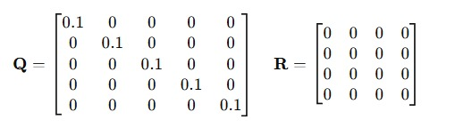
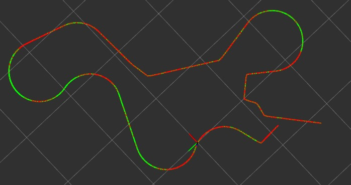

# Module 6 Assignment: IMU and GPS Sensor Fusion for TurtleBot3

## Objective

This assignment focuses on implementing and analyzing an Extended Kalman Filter (EKF) for fusing IMU and GPS data to improve the localization accuracy of TurtleBot3 in a simulated environment. You will create a sensor fusion node, visualize the results, and experiment with different noise covariance matrices to understand their impact on the robot's state estimation.

## Task: IMU and GPS Sensor Fusion for TurtleBot3

### Task Details

1. **Set Up the Sensor Fusion Node:**

Clone the turtlebot3 + gps repository in your workspace

```sh
git clone https://github.com/Combuster54/turtlebot3_gps
```

Compile and launch Turtlebot3 + GPS

```sh
colcon build && source install/setup.bash
```

```sh
ros2 launch module_6_assignment ekf_tb3_imu_gps.launch.py
```

4. **Experiment with Different Q and R Values:**

First set of Q R






Observations:
Overlap and Divergence:

The paths are mostly overlapping, but there are slight deviations in regions where the paths diverge. These differences suggest that the EKF is compensating for errors or noise in the sensor measurements to provide smoother estimates.

High Trust in Measurements:

R 

R=0 implies that the EKF assumes perfect sensor measurements. This means the system places very high confidence in sensor data (GPS and IMU), leading to paths being very close but with limited adjustment from the prediction step.
Low Process Noise:


Q with diagonal values 

0.1 indicates low uncertainty in the process model. The EKF trusts the dynamic model for predicting the robot's state, but this trust is limited compared to perfect process knowledge.


Second set of Q R Values


## Submission Process

1. **Create Files:**
   - Navigate to the `module_6_assignment` package.
   - Create the required files for the EKF node, the custom launch file, and the documentation.

2. **Document Your Work:**
   - Create a `README.md` file in the `module_6_assignment` package.
   - Provide details about the files you created, including explanations of the code and the commands needed to run your sensor fusion node and visualizations.

3. **Submit Your Assignment:**
   - Push your changes to your forked repository.
   - Provide your repository link in the assignment submission text area.
   - **Note**: Ensure you press the "Start Assignment" button when you see the page (as it takes time to generate the pages).

4. **Wait for Review:**
   - Wait for the instructors to review your submission.

## Learning Outcome

By completing this assignment, you will:
- Understand the principles of sensor fusion using an Extended Kalman Filter (EKF).
- Gain hands-on experience with fusing IMU and GPS data to improve robot localization.
- Learn how to configure and tune an EKF for optimal performance in a simulated environment.
- Develop the skills to visualize and analyze fused sensor data using ROS 2 and RViz.
